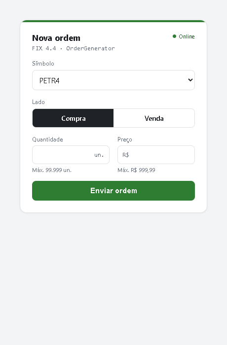
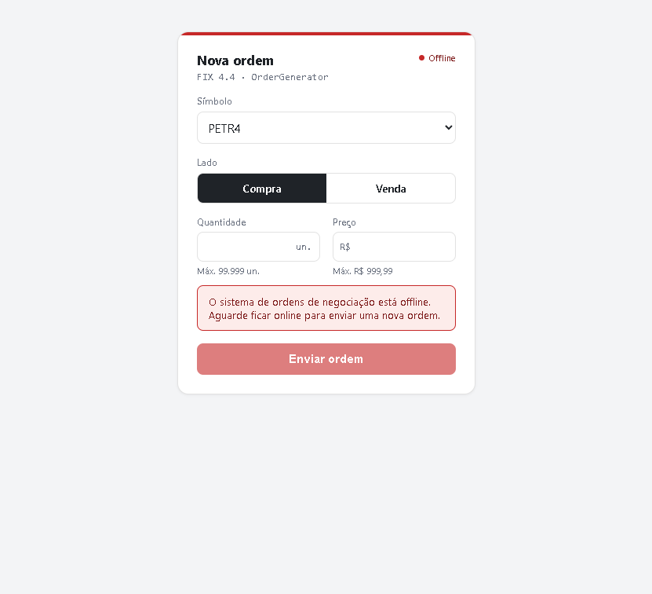
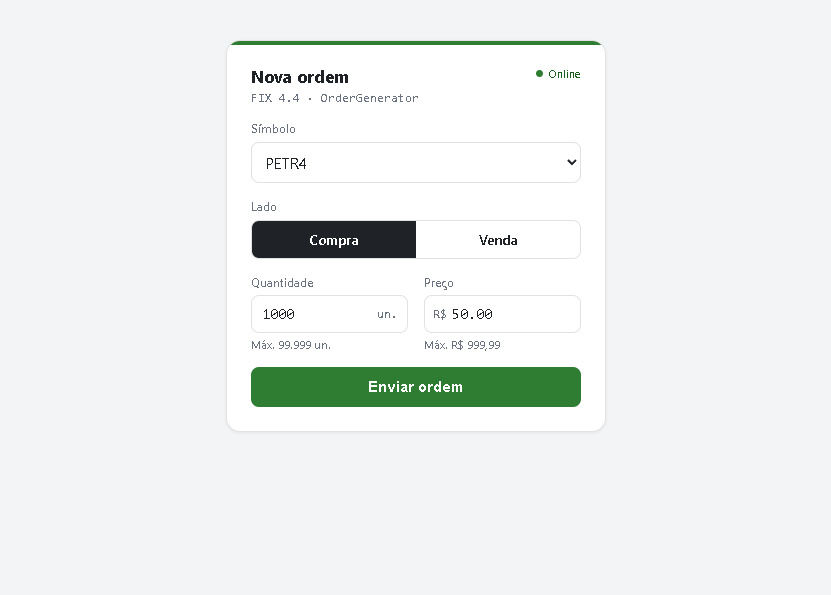
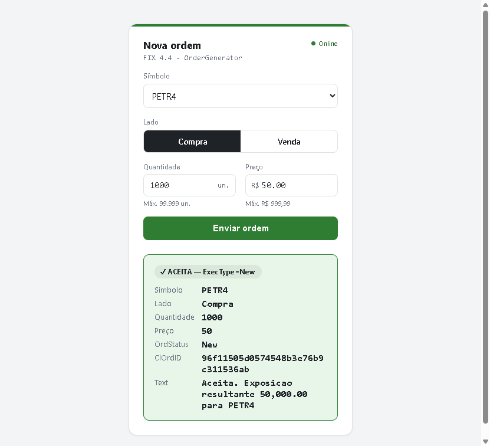
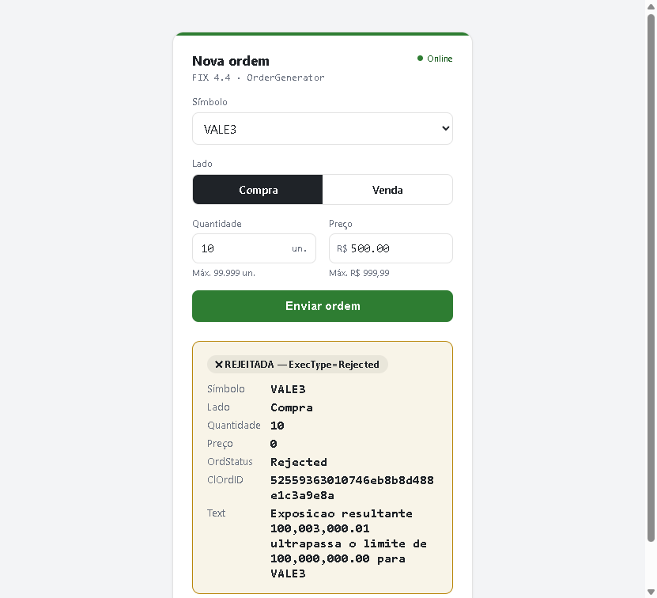

# Order Exposure Control (FIX 4.4)

Duas aplicações em C# que se comunicam via protocolo FIX 4.4 (QuickFIX/n): um
**OrderGenerator** com formulário web que envia ordens (`NewOrderSingle`) e um
**OrderAccumulator** que controla a exposição financeira por símbolo contra um limite
de R$ 100.000.000, respondendo com `ExecutionReport` (aceite ou rejeição).

> This is a challenge by [Coodesh](https://coodesh.com/)

## O que é FIX 4.4?

[FIX](https://www.fixtrading.org/) (Financial Information eXchange) é o protocolo
padrão da indústria financeira para troca de mensagens de negociação em tempo real —
ordens, execuções, cotações — usado entre corretoras, bolsas e sistemas de gestão de
ordens desde os anos 90. Mensagens são pares `tag=valor` (ex.: `35=D` identifica o tipo
da mensagem, `55=PETR4` é o símbolo); a versão usada aqui é a **4.4**.

Uma sessão FIX conecta um ***initiator*** (quem abre a conexão TCP e envia ordens) a um
***acceptor*** (quem aceita a conexão e responde) — neste projeto, o
**OrderGenerator é o initiator** e o **OrderAccumulator é o acceptor**. A sessão troca
*heartbeats* periódicos para detectar queda de conexão, e cada mensagem carrega um
número de sequência para detectar perda de mensagem.

As duas mensagens que este sistema troca:

- **`NewOrderSingle`** (`35=D`): o OrderGenerator envia essa mensagem para propor uma
  nova ordem — símbolo, lado, quantidade e preço.
- **`ExecutionReport`** (`35=8`): o OrderAccumulator responde com essa mensagem,
  informando se a ordem foi aceita (`ExecType=New`) ou rejeitada (`ExecType=Rejected`,
  com o motivo).

## Documentação

- [`docs/PRD.md`](docs/PRD.md) — especificação original do desafio.
- [`CONTEXT.md`](CONTEXT.md) — dicionário do modelo de domínio (termos, definições e
  sinônimos a evitar).
- [`docs/adr/`](docs/adr) — decisões de modelagem não óbvias.

## Tecnologias

- **.NET 10** / C#
- **QuickFIXn** (`QuickFIXn.Core` + `QuickFIXn.FIX44`) — engine do protocolo FIX 4.4
- **ASP.NET Core Minimal API** + HTML/JS estático (frontend do OrderGenerator)
- **xUnit** — testes da lógica de negócio

## Arquitetura

```
Browser ──HTTP/JSON──> OrderGenerator ──FIX 4.4 (TCP :5001)──> OrderAccumulator
 (form)                (web + initiator)   NewOrderSingle          (acceptor)
                                    <── ExecutionReport (New/Rejected) ──
```

- **OrderGenerator** (`src/OrderGenerator`): app ASP.NET Core única que serve o
  formulário e hospeda o *initiator* FIX in-process. O `POST /api/orders` monta a
  ordem, envia pela sessão FIX e aguarda o `ExecutionReport` correlacionado por
  `ClOrdID` (ponte assíncrona→síncrona via `TaskCompletionSource`, timeout de 5s).
  Valida o formato antes de enviar (fail-fast): entrada inválida responde `400` e
  **nunca** vira mensagem FIX.
- **OrderAccumulator** (`src/OrderAccumulator`): console *acceptor*. É a **autoridade**
  de validação — revalida todas as regras de campo e a de exposição. Mantém a
  exposição por símbolo em memória (`ConcurrentDictionary`), com a verificação do
  limite e a atualização atômicas sob lock por símbolo.

### Regras de negócio

- **Símbolos**: PETR4, VALE3, VIIA4.
- **Lado**: Compra (aumenta exposição) ou Venda (diminui).
- **Quantidade**: inteiro positivo, `< 100.000`.
- **Preço**: decimal positivo, múltiplo de 0.01, `< 1.000`.
- **Exposição** por símbolo: `Σ(preço × qtd de Compras) − Σ(preço × qtd de Vendas)`.
- **Limite**: R$ 100.000.000 sobre o **valor absoluto** da exposição. Uma ordem cuja
  exposição resultante **ultrapasse** (estritamente `>`) o limite é rejeitada e não
  entra no cálculo. Exatamente no limite é aceita.
- **Aceite** ⇒ `ExecutionReport` com `ExecType=New` e a ordem entra no cálculo.
  **Rejeição** ⇒ `ExecType=Rejected`, com o motivo em `Text` (tag 58), sem entrar no
  cálculo.

## Decisões técnicas

Além das decisões de negócio (ver ADRs), a solução consolidou as seguintes escolhas de
infraestrutura e organização de código:

- **Generic Host** (`Host.CreateApplicationBuilder`) nos dois processos, com shutdown
  limpo em `SIGTERM`/`SIGINT` via `IHostedService` — necessário para `docker stop` fazer
  logout FIX corretamente em vez de derrubar a sessão.
- **Log de mensagens FIX** cru em disco (`FileLogFactory`, em `fixlog/`), separado do log
  de aplicação — trilha de auditoria independente do que a aplicação decide logar.
- **`OrdRejReason`** (tag 103) preenchido em toda rejeição, além do texto livre em `Text`
  (58) — permite a um cliente FIX real decidir programaticamente o que fazer com a
  rejeição, não só exibi-la.
- **`ProblemDetails`** (RFC 7807) como contrato único de erro do `OrderGenerator`
  (`400`/`503`/`504`/`429`), com `UseExceptionHandler` como rede para o inesperado.
- **Rate limiting** nativo do ASP.NET Core em `POST /api/orders` (ver seção própria
  abaixo) — único endpoint HTTP externo do sistema.
- **Health check** do `OrderGenerator` baseado no estado da sessão FIX, usado pelo
  `docker compose` para sequenciar a subida dos dois serviços.
- **Higiene de build**: `Directory.Packages.props` (Central Package Management, evita
  divergência de versão do QuickFIXn entre os dois lados do protocolo),
  `Directory.Build.props` compartilhado, `global.json` fixando o SDK, `.editorconfig`
  registrando o estilo já praticado.
- **Organização de código**: `OrderAccumulator` em `Application/` (protocolo FIX) +
  `Domain/` (regra de negócio pura); `OrderGenerator` como uma única vertical slice
  `Orders/` — projeto simples demais (3 classes) para justificar separar
  Domain/Application ali.

## Fora de escopo consciente

Itens que um sistema de controle de risco *de verdade* exigiria, mas que estão além do
que o [PRD](docs/PRD.md) descreve. Registrados para que a ausência seja lida como
decisão, não como esquecimento:

- **Persistência de exposição e de sequence numbers FIX.** Os dois processos usam
  `MemoryStoreFactory`: reiniciar o Accumulator zera o controle de risco, e sem seqnum
  persistido o resend/recovery do FIX não funciona entre execuções. Em produção,
  `FileStoreFactory` (ou banco) seria obrigatório.
- **Idempotência por `ClOrdID`.** Sem deduplicação, um resend FIX após reconexão seria
  contabilizado duas vezes na exposição — consequência direta do item acima.
- **Autenticação de sessão.** `ToAdmin`/`FromAdmin` vazios nos dois lados: nenhuma
  validação de credenciais no Logon (tags 553/554) nem whitelist de `CompID`. Qualquer
  processo que alcance a porta 5001 pode abrir sessão.
- **Métricas/OpenTelemetry** nos dois processos.
- **CI.** Um workflow de build + test é o passo natural seguinte ao `docker compose`.

## Como executar

### Via Docker Compose

Pré-requisito: Docker com Compose v2.

```bash
docker compose up --build
```

Sobe os dois serviços na ordem certa (`generator` espera o *healthcheck* do
`accumulator` antes de conectar) e expõe **`http://localhost:5080`**. A porta FIX
5001 fica só na rede interna do Compose — o formulário web é a única porta publicada
no host.

### Via `dotnet run`

Pré-requisito: [.NET 10 SDK](https://dotnet.microsoft.com/download).

Abra **dois terminais** na raiz do repositório.

1. Suba o acumulador primeiro (acceptor FIX na porta 5001):

   ```bash
   dotnet run --project src/OrderAccumulator
   ```

2. Suba o gerador (web + initiator):

   ```bash
   dotnet run --project src/OrderGenerator
   ```

3. Abra **`http://localhost:5080`** no browser, preencha o formulário e envie. A
   resposta do `ExecutionReport` aparece na própria página.

> `5080` é a **página web** (OrderGenerator, HTTP). `5001` é o **socket FIX** do
> OrderAccumulator (TCP puro) — abrir `5001` no browser trava em loading, pois não é
> um servidor web. Use sempre `5080` na UI.

> O gerador reconecta sozinho se o acumulador ainda não estiver no ar. O estado é em
> memória: reiniciar o acumulador zera a exposição.

## Formulário de nova ordem

O formulário em `http://localhost:5080` é o único ponto de entrada do sistema.

| Campo | Regra |
|---|---|
| **Símbolo** | PETR4, VALE3 ou VIIA4 (únicos aceitos) |
| **Lado** | Compra (aumenta a exposição do símbolo) ou Venda (diminui) |
| **Quantidade** | Inteiro entre 1 e 99.999 |
| **Preço** | Decimal entre R$ 0,01 e R$ 999,99, múltiplo de 0,01 |

### Online / offline

A página consulta `/health` a cada 5 segundos — o indicador no canto superior direito e
a cor da barra de destaque refletem o estado da sessão FIX com o OrderAccumulator:

**Online** — sessão ativa, botão habilitado:



**Offline** — OrderAccumulator fora do ar ou logon ainda não concluído: um aviso
substitui o botão, que fica desabilitado, e qualquer resultado/validação anterior é
limpo da tela:



### Enviando uma ordem

Ao clicar em "Enviar ordem", o botão é desabilitado (evita duplo submit — duas ordens
por dois cliques rápidos contariam duas vezes na exposição), o formulário é validado no
browser (mesmas faixas da tabela acima) e só então o `POST /api/orders` é enviado:



A resposta aparece abaixo do formulário, no formato do `ExecutionReport` devolvido pelo
OrderAccumulator:

**Aceita** (`ExecType=New`) — a ordem entrou no cálculo da exposição do símbolo:



**Rejeitada** (`ExecType=Rejected`) — motivo em texto livre no campo `Text` (mesmo
conteúdo da tag FIX 58); no exemplo abaixo, por ultrapassar o limite de exposição de
R$ 100.000.000:



## Logs

Além do log de aplicação (console), os dois processos gravam a trilha bruta de
mensagens FIX (Logon, `NewOrderSingle`, `ExecutionReport`, heartbeats) em
`fixlog/<CompID>.messages.current.log`, e eventos de sessão (conexão, logon, logout)
em `fixlog/<CompID>.event.current.log`. Via `docker compose`, cada serviço tem um
volume nomeado montado em `/app/fixlog`, que sobrevive a `docker compose down`/`up`
(diferente da exposição e das sessões FIX, que são em memória e resetam):

```bash
docker compose exec accumulator cat fixlog/FIX.4.4-ORDERACC-ORDERGEN.messages.current.log
docker compose exec generator   cat fixlog/FIX.4.4-ORDERGEN-ORDERACC.messages.current.log
```

Via `dotnet run`, o diretório `fixlog/` fica local a cada projeto
(`src/OrderAccumulator/fixlog`, `src/OrderGenerator/fixlog`).

O console também mostra eventos de sessão (`<event> Received logon`, etc.) junto dos
logs de aplicação; os dumps completos de mensagem (incluindo heartbeat a cada 30s) só
vão para o arquivo, para não poluir `docker compose logs`.

## Rate limiting

`POST /api/orders` (único endpoint HTTP externo) tem rate limiting nativo do ASP.NET
Core: **10 requisições / 10s por IP** (fixed window, sem fila — excedente responde
imediatamente), configurável em `OrderGenerator:RateLimit` no `appsettings.json`.
Excedido o limite, a resposta é `429` no mesmo formato `ProblemDetails` dos outros erros
do endpoint. `/health` não é afetado.

## Testes

```bash
dotnet test
```

Cobrem a matriz de exposição/limite (incluindo a fronteira exata, exposição vendida
líquida e concorrência sob o lock por símbolo) e as quatro regras de validação.
